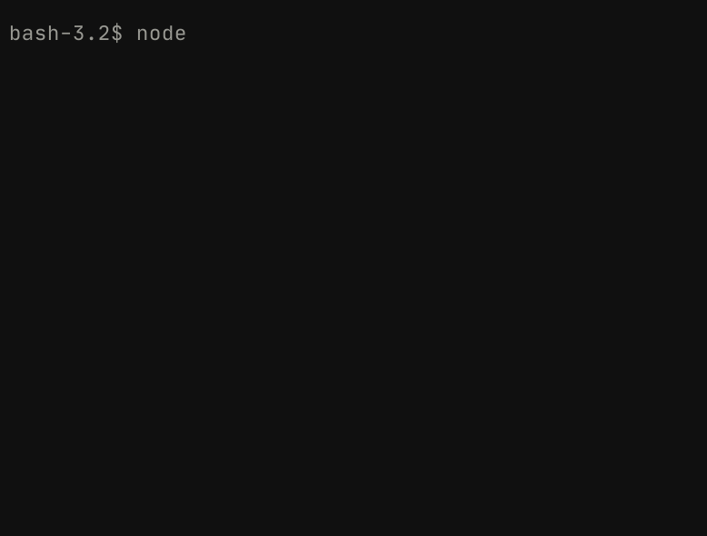
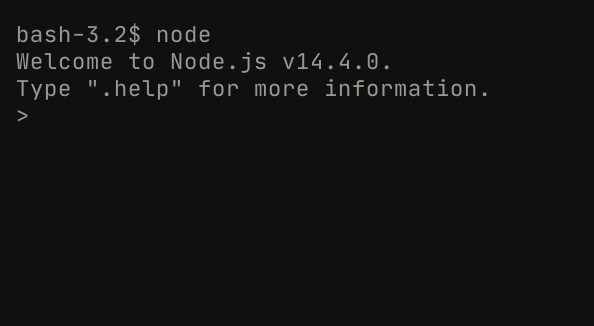
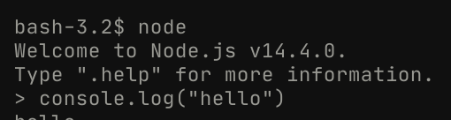

# Hello, World!

Now that you've installed your JS runtime, we can finally get into learning the language!

Before we do that, though, we need to go through some command line basics.

## The command line

Unlike the fancy GUIs (graphic user interfaces) that browsers provide, terminals are fairly barebones. They consist of one screen, a scrolling piece of text, and a little place to input some text.

Because terminals are so minimalist, they can also do a _lot_ of things! They give developers complete control over their computers, which is also why they're the tool of choice when building lower level projects. GUIs are a higher level abstraction over the things that can be done in terminals.

To run a command, click on your terminal window and run `$ node` without typing in the `$` (when you see code blocks that begin with `$`, the text after the dollar sign symbolizes the command that you should run) into the terminal, like so:



When you press the 'Enter' key, the command that you typed into the terminal gets run, and you should see your screen update to something like this:



Congratulations! You've run your very first command line program.

Commands can also take in arguments to change their behaviour.

For instance, running `$ echo` won't do anything, but the `echo` command takes in arguments. This command simply logs out a piece of text. Try running `$ echo hi`. Did the word 'hi' pop up on your screen? In this case, "hi" was the argument passed into `echo`.

There are millions of commands out there to interact with, and each of them has their own usage semantics. This book will largely focus on the `node` and `npm` (we'll get to the latter a little later) commands, but feel free to experiment with anything you come across on your journey!

## The `node` command

When you run `$ node`, something odd happens. You don't return to the normal line in your shell for input, you get entered into a kind of sub-terminal. This is what's known as a REPL; a Read, Evaluate, Print Loop. It's a common method of learning a language, and allows you to run single lines of a language for execution.

Whenever a code block starts with a `>` in this book, you should run the text after it in Node's REPL (you can access it anytime by running `$ node`).

This REPL is also going to be the place that we run our first JavaScript program!

Try running `> console.log("hello")` in the REPL, like so:



When you've run that, you should see "hello" pop up in your output!

Give yourself a pat on the back—you're officially a JS developer. This single line of code is perfect idiomatic JavaScript, and Node's just executed it flawlessly!

Don't worry about understanding this piece of code right now; all that you need to move forwards is the ability to open up a terminal and get to Node's REPL.

## Files with the `node` command

Node wouldn't be very useful if it could only execute programs line by line with no ability to save. Luckily, you can execute JS programs in Node from files by passing in a parameter for the file's name.

To try this out, run the following commands in your terminal:

```bash
$ cd ~
$ touch index.js
$ echo 'console.log(3)' > index.js
$ node index.js
```

The first line changes directories (the equivalent of clicking on a different folder in your file explorer) into what's known as your 'home' directory (the top level of your file tree).

The second line creates a file named `index.js`, and the third simply puts the line of JS code `console.log(3)` into it, using the pipe operator.

Finally, we pass the name of the local file into the `node` command to run it.

> Alternatively, you can use one of the many thousands of online code execution platforms out there. [Replit](https://replit.com) is a popular online editor for running Node programs; if you don't want to go through the pain of constantly switching between directories, using their Node template can be a good shortcut.

## Quiz!

Before moving on, make sure you can answer the following questions for yourself (answers are provided):

<details>
  <summary>Q: What is the terminal, and why is it used in development more than GUIs?</summary>
  
  **A:** A terminal is a text-based system for interacting with a computer. Because the only possible interactions between a user and the terminal are through text, it's much easier to develop a program for the command line than it is to develop one with a GUI. As such, terminals have far more capabilities than regular GUI applications do; this flexibility means that developers can be more efficient in their work with the terminal.
</details>

<details>
  <summary>Q: What is a runtime in programming? What is V8?</summary>
  
  **A:** A runtime environment is simply a toolset that gives developers the ability to execute programs in a given language on their machine. V8 is the runtime that Google Chrome uses to execute JavaScript, and was adapted for the terminal by Node.
</details>

<details>
  <summary>Q: What is a REPL?</summary>
  
  **A:** REPL stands for Read, Evaluate, Print, Loop. It is a simple way of executing programs line-by-line (generating output each time a new line is created), and is a useful way of learning a new language.
</details>
